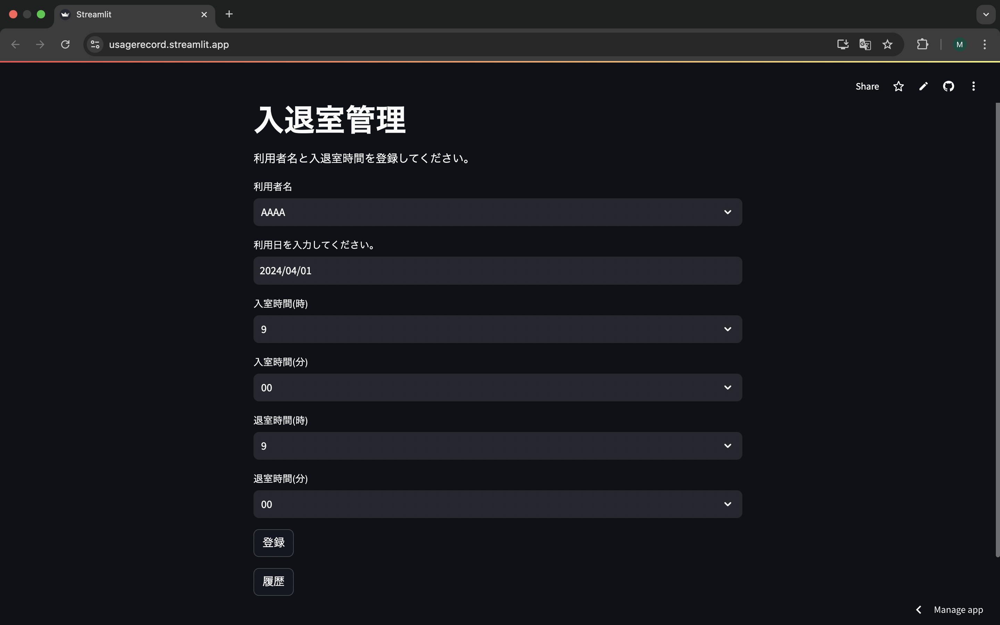

# 入退室管理アプリ

## 本アプリでの対応範囲
- 要件定義
- 設計書作成
- モック作成
- DB構築
- バックエンド実装
- フロントエンド実装
- コンテナ構築
- 単体テスト
- 結合テスト
- **`クラウドサービスにデプロイ`**
- ユーザーテスト
- 本番環境へデプロイ

## 概要
大学での共用スペースでの利用記録をノートではなく画面入力で行えることを想定したアプリとなります。

## 技術スタック
### 使用技術
- Python
- Streamlit
- sqlite3

### 選定理由
下記の3点を重視したことによります。
- Pythonを通してシンプルさを重視したアプリケーションのアウトプットをすること
- Streamlitを利用することでUIやデータ処理の実装だけでなく簡易的なデプロイが行えること
- sqlite3を導入することでデータ処理をPython内で完結できること

## 主な機能
下記の3点となります。
- セレクトボックスを通して利用者名や時間帯、カレンダーを通して利用日を選択すること
- 登録ボタンを押下することで利用者名、利用日、時間帯を登録すること
- 履歴ボタンを押下することでDBに登録されている利用記録を表示すること

## 操作方法
[こちらのリンク](https://usagerecord.streamlit.app/)から下記の画面が表示されることを確認します。

履歴ボタンを押下すると既にDBで登録されている記録を確認できます。

ここで表示されている **(1, 'AAAA', '2025-01-06', '9', '00', '10', '00')**は記録IDは1でAAAAさんが2025年1月6日の9:00-10:00にかけて部屋を利用していたことを意味します。

各セレクトボックスやカレンダーにて登録内容を設定します。

設定ができたら登録ボタンを押下し、下記の表示がされることを確認します。

ここで改めて履歴ボタンを押下すると、記録ID2でBBBBさんが2025年1月6日の10:30-12:00で利用していた記録が登録されていることを確認できます。

## 次回以降の取り組み
### [lesson-assumed-app](https://github.com/MasaNakamura-ctrl/lesson-assumed-app)で行うこと
- データ処理で更新と削除まで行えるようにすること
- 最低限のUIを自身で作成し、バックエンドにてDBへデータの受け渡しができるようにすること
- 画面設計書の作成や単体テストを行い、より実務的な開発プロセスを反映させること
